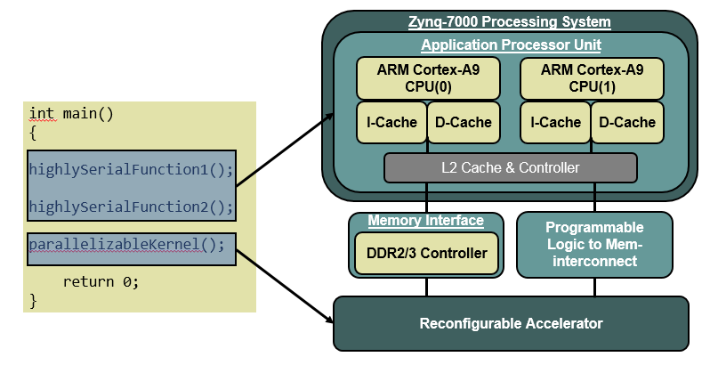
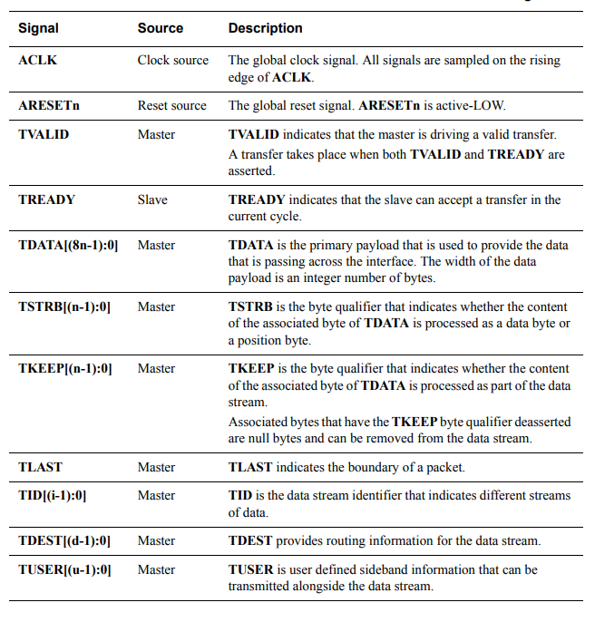
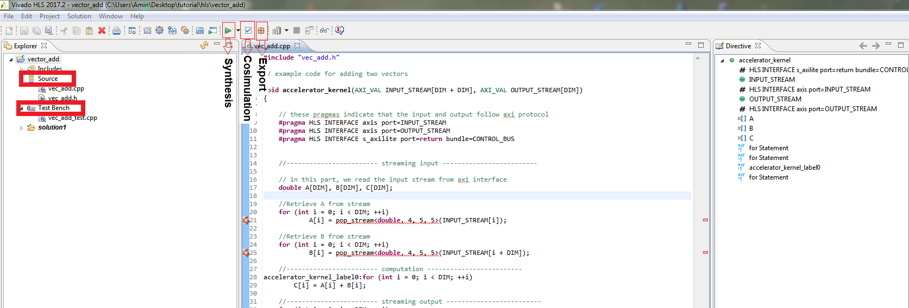
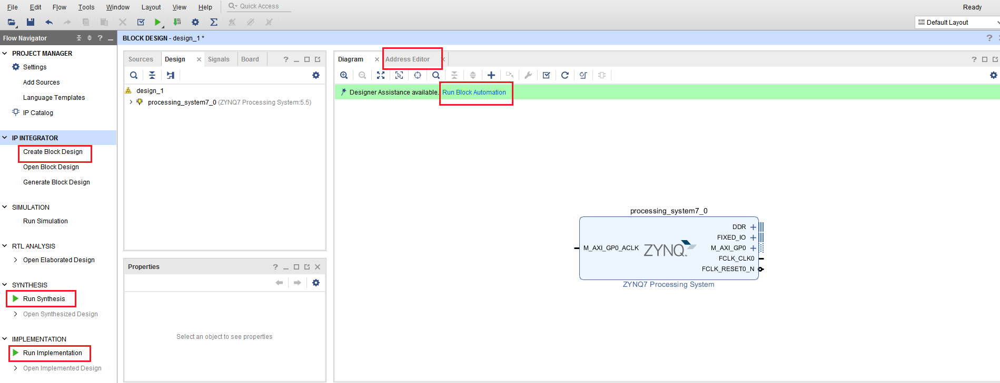
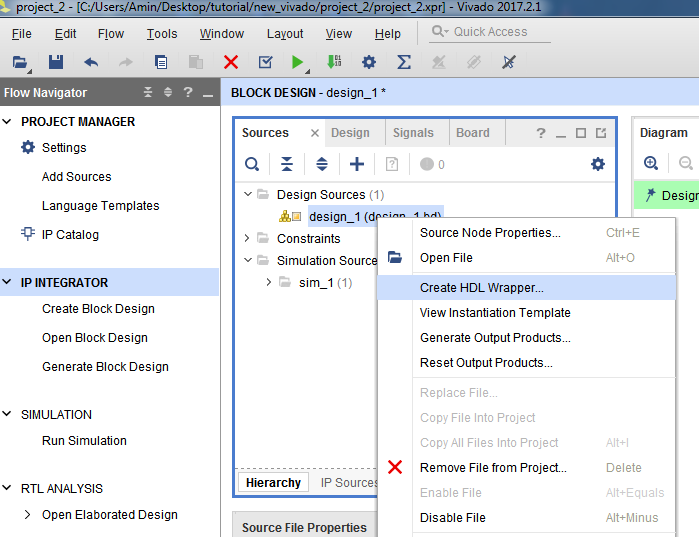

**Introduction**

In this tutorial, we will design an accelerator for adding two vectors
element by element. We will use Xilinx Vivado HLS to write the
accelerator code in a high level language specification (C++), after
that, we will design the system in Vivado and synthesize it, and
finally, we will use Xilinx SDK to program the ARM microprocessor.

**Platform**

The design will be targeting Xilinx ZC702 board. This FPGA board is from
[*Xilinx Zynq®-7000 All Programmable
SoC*](https://www.xilinx.com/support/documentation/data_sheets/ds190-Zynq-7000-Overview.pdf)
family. This development board features a Dual-core ARM Cortex-A9 MPCore
along with an Artix-7 FPGA. The idea of SoC FPGA is to have the hard
processor core (ARM) and the programmable logic (FPGA) on the same chip
in order to mitigate the communications between the two. To learn more
about the motivations behind the SoC FPGAs, refer to this
[*link*](https://www.datarespons.com/soc-fpga-evaluation-guidelines/).
Usually, hard processor handles data initializations, and other parts of
the code that have to be executed serially, while the FPGA performs the
main acceleration task.

{width="6.5in" height="3.3333333333333335in"}

Figure 1. Zynq-7000 architecture

Throughout this tutorial, PS (Processing System) refers to the ARM
microprocessor and PL (Programmable Logic) refers to the FPGA.

**Tools**

The following tools are required for designing the accelerator:

-   **Xilinx Vivado**: allows synthesis, placement, and routing of the
    design. Vivado is pretty much similar to ISE with more features
    (High-Level Synthesis and System on Chip support)

-   **Xilinx Vivado High-Level Synthesis (HLS)**: HLS enables generating
    RTL code from a high-level language (C/C++) specifications. The idea
    is to boost developer productivity, since writing RTL can be time
    consuming; on the other hand, RTL provides a lower level design
    abstraction which can lead to a better performance.

-   **Xilinx Software Development Kit (SDK):** For developing and
    debugging the software application (C/C++) that is going to be
    executed on PS.

**Installation**

All the mentioned tools can be found in Vivado design suite from [*this
link*](https://www.xilinx.com/support/download.html) (you need to create
a xilinx account in order to download the tool). There are three
editions that you can install: design, system, and WebPACK. Make sure
that Software Development Kit (SDK) is checked and will be installed.

Regarding the devices, select Zynq-7000, you can uncheck the rest;
however, devices can be added after installation.

**Advanced eXtensible Interface (AXI) \[[*Reference
Guide*](https://www.xilinx.com/support/documentation/ip_documentation/axi_ref_guide/v13_4/ug761_axi_reference_guide.pdf)\]**

Before jumping into designing the accelerator, we need to learn about
AXI protocol. AXI is A master/slave standard for connecting different
modules (IPs) on a chip. It allows data to be transferred from PS to PL
or vice versa or among different blocks in the FPGA. A list of AXI
signals can be seen in the figure below.

{width="6.5in" height="6.791666666666667in"}

Table 1. AXI Interface Signals (Adapted from [*protocol
documentation*](http://www.mrc.uidaho.edu/mrc/people/jff/EO_440/Handouts/AMBA%20Protocols/AXI-Stream/IHI0051A_amba4_axi4_stream_v1_0_protocol_spec.pdf))

Since we will be using HLS to design the accelerator, we don’t need to
set these signals in our code and it’s taken care of by Vivado HLS.

AXI has three different interfaces:

-   **Memory Mapped**: In this interface, all read and write
    transactions need to have a memory address.

-   **Stream:** AXI stream has one channel which allows the data to flow
    from Master to Slave. The vector add accelerator that we are going
    to design will be using this interface.

-   **Lite:** AXI Lite is similar to memory mapped except that it
    doesn’t support burst transactions. We will be using this interface
    for transmitting control signals (For example, PS needs to start the
    execution of the accelerator or check if the accelerator is ready to
    receive data)

Let’s say that the accelerator uses AXI stream, in order to move the
data from PL to PS, we need to convert AXI stream to AXI memory mapped
and vice versa. This conversion is done by AXI Direct Memory Access
(DMA) module.

AXI interconnect is a component that allows connecting multiple slaves
to multiple masters (even with different data widths and clocks) by
routing the data and the requests according to the addresses.
Furthermore, PS in ZYNQ supports AXI3 protocol while the IP cores in PL
will use AXI4, AXI interconnect allows the connection between PS and PL
by converting AXI3 to AXI4 and vice versa.

**Vector Add Project**

Now we will build the vector add accelerator. The input data will be
initialized in PS , and then is sent to the PL, the PL performs the
addition and sends the data back to the PS.

We can write the vector add accelerator in both RTL or HLS. We choose
HLS for the sake of learning.

**Vivado HLS**

Open Vivado HLS and create a new project, you don’t need to set the top
function name or add any files at this point, set clock period to 10 and
select **xc7z020clg484-1** as device part. Add vec\_add.cpp and
vec\_add.h under the Source directory. From project select properties
and enter the top function name (acelerator\_kernel) in the synthesis
tab.

Press the green play button in order to start the synthesis. For some
reasons, Vivado HLS sometimes highlights some lines as errors, you can
ignore them as long as they don’t appear in the synthesis console.

Before exporting the IP, we can run a test case to verify the
functionality of our code. Add vec\_add\_test.cpp file under the Test
Bench directory, and press Run C/RTL Cosimulation which is right next to
the Run Synthesis button. You don’t need to modify the default settings.
This test bench compares the results of the accelerator ip with software
(accelerator\_sw function which we call C model) to make sure that they
match.

After that, we can export the written code as an IP so that we can
instantiate it in Vivado and connect it to the PS which is the next
step. Click on Export RTL (right next to the Run C/RTL Cosimulation) and
press ok. The default export location is
project\_name/solution1/impl/ip. Next, we will use Vivado to use the
generated ip in block design.

{width="6.5in" height="2.2083333333333335in"}

Figure 2. Xilinx Vivado HLS Environment

**Vivado Design Flow**

Create a new RTL project in Vivado and check *Do not specify sources at
this time*, select xc7z020clg484-1 as device part. From the left menu,
select *create block design*. Vivado opens an empty diagram that is
going to represent the SoC. In this diagram, we can add the ARM
processor, xilinx IPs, our own generated IPs, and other blocks that are
required for interconnections among these blocks.

You can see the final block design in Vivado directory in Google Drive

{width="6.5in" height="2.5in"}

Figure 3. Vivado Environment

Right click on an empty space and select Add IP (ctrl + i), then type
*ZYNQ7 Processing System* and add it to the diagram. This block
represents the ARM processor (PS). After you add the IP, Vivado designer
assistance suggest *Run Block Automation* (above the diagram), click on
it and leave the options as default. The symbol that is connected to DDR
and IO pins represents an external interface and it means that these
pins will be connected to some chips outside the FPGA. We won’t be using
them in this project.

Next we need to enable some of the pins and features of the processor.
Double click on the *ZYNQ7* block. In the opened window, you can see the
architecture of Zynq, from page navigator select *PS-PL Configuration*
and enable *S AXI ACXP interface* from *ACP Slave AXI interface*. This
port will be used for writing back the results of the vector add to the
processor’s memory. Next, from *Peripheral I/O Pins* enable *UART 1*. We
connect the UART port of the FPGA to the host computer so that we can
see the messages that are printed in the ARM code (*printf* function).
Finally, from *Interrupts* enable *IRQ\_F2P*\[15:0\] which is under
*Fabric Interrupts/PL-PS Interrupt Ports*.

Next, we will add the exported HLS IP to the diagram. From *Tools* menu
select *setting*, then select *Repository* from *IP* and enter the
directory for the HLS IP (/solution1/impl/ip). The *Accelerator\_kernel*
IP should be found by Vivado.

Press ctrl + i in the diagram window and select *accelerator\_kernel*.
Once again, click on Run Connection Automation, Vivado will connect
*s\_axi\_CONTROL\_BUS* to *M\_AXI\_GP0* on the processor.
*s\_axi\_CONTROL\_BUS* is a set of signals that the microcontroller uses
to control the IP, for example to start the execution of the IP or
finding out when the IP is ready to receive new data. This bus is
created by the pragma that we put in the HLS code:

*\#pragma HLS INTERFACE s\_axilite port=return bundle=CONTROL\_BUS*

Also, notice that Vivado generates a system reset module and routes
reset and clock signals of the modules.

The next port that we are going to connect is the interrupt in the HLS
IP, this port is also created by the same pragma. Connect the interrupt
to *IRQ\_F2p*\[0:0\] port on ZYNQ.

Next, we need to connect the *INPUT\_STREAM* port to the microcontroller
so that we can send the input data from ARM to the accelerator. Press
ctrl+i and add *AXI Direct Memory Access* (AXI DMA) to the block design.
This IP is used for data transfer between PS and PL. Double click on the
AXI DMA and uncheck “*Enable Scatter Gather Engine*”. This option allows
the DMA to transfer data without ARM control signals which we will not
be using for now. Also, set Memory Map Data Width to 64, since the HLS
IP uses 64bits data as input and output.

Since INPUT\_STREAM is a slave port (meaning that we want to write to
it), we should connect it to the master port on the AXI DMA. Also, the
HLS IP is an AXI stream module and the ARM processor on the other hand,
can talk to memory mapped interfaces, so we need to connect
*INPUT\_STREAM* to *M\_AXIS\_MM2S* port on the AXI DMA.

Next, connect *OUTPUT\_STREAM* port to the *S\_AXIS\_S2MM* port on the
AXI DMA. Press ctrl + i and add AXI SmartConnect module. Connect
*M\_AXI\_MM2S* and *M\_AXI\_S2MM* from AXI DMA to the *S00\_AXI* and
*S01\_AXI* ports on the AXI SmartConnect and connect the *M00\_AXI* port
from SmartConnect to the *S\_AXI\_ACP* port of ZYNQ. These two ports are
for writing from DMA to the ARM.

Next, click on *Run Connection Automation* to connect the clock signals
and also connect the *S\_AXI\_LITE* signal to *M\_AXI\_GP0*, ARM uses
this signal to control the AXI DMA data transfers.

Right above the diagram, there is another tab which is *Address Editor*.
Every IP that is presented in the diagram needs to have an address so
that they can talk to each other. From the Address Editor tab right
click on the *processing\_system7\_0* and select *Auto Assign Address*.

Save the block design and from the *Sources* tab, right click on the
*design\_1* and select *create hdl wrapper*. By choosing this, Vivado
automatically generates the top module for our design. Once again right
click on the *design\_1* and select *Generate Output Products*, Vivado
will start synthesizing each IP core separately.

After that generating output products is finished (you can check it on
the top right), we can *Run Synthesis* and after the synthesis is
finished we can *Run Implementation* which includes optimizing the
design, placement, and routing, and finally *Generate Bitstream*.

{width="6.5in" height="5.0in"}

Now we can export the hardware platform that we have designed in Vivado,
so that we can use it in the SDK in order to program the processor. From
*File &gt; Export &gt; Export Hardware* and click ok, this file includes
configurations, parameters, and address of all components so that PS can
program the control registers. From *File&gt; Launch SDK* and select the
same directory that you used for exporting hardware for Exported
location and Workspace.

**Xilinx SDK**

You can see the exported hardware in the Project Explorer window.
*system.hdf* file contains all the IPs and their addresses. From *File
&gt; New &gt; Application Project* create a new project with the default
settings and in the next window select *Hello World* project. Include
accelerator.c, accelerator.h, and main.c files from Google Drive to the
src directory of the new project. Notice that SDK has also created a
Board Support Package (BSP) project. BSP contains libraries for ARM’s
operating system and other features such as TCP/IP.

Now, all you need to do is to program the FPGA from Vivado and run the
SDK project :)
